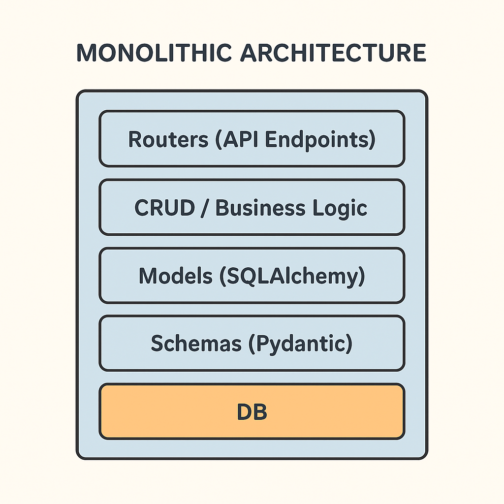

### 1. write down small set of user stories

- As a user I need to create a template(Daily/Monthly/yearly/quaterly)
- As a user, I should be able to add tasks under a template.
- As a user, I should be able to view templates and their tasks.
- As a user, I should be able to edit or delete a template.
- As a user, I should be able to edit or delete a task.
- As a user, I should be able to mark a todo as completed.

### 2. Identify entities + attributes

1. User

user_id (PK)

name

email

password_hash (if authentication needed)

created_at

2. Template

template_id (PK)

user_id (FK → User)

title (e.g., Daily, Monthly, Custom name)

type (enum: daily, monthly, quarterly, yearly)

description

created_at

updated_at

3. Template_Tasks

template_task_id (PK)

template_id (FK → Template)

title

description

priority (optional: low, medium, high)

4. Todos

todo_id (PK)

template_task_id (FK → Template)

user_id (FK → User)

status

created_at

updated_at

### 3. Tables to create in db

```
CREATE TABLE users (
    user_id BIGSERIAL PRIMARY KEY,
    name TEXT NOT NULL,
    email TEXT UNIQUE NOT NULL,
    password_hash TEXT,  -- nullable if using Gmail OAuth
    created_at TIMESTAMPTZ NOT NULL DEFAULT NOW()
);
```

```
CREATE TYPE template_type AS ENUM ('daily', 'weekly', 'monthly', 'quarterly', 'yearly');

CREATE TABLE templates (
    template_id BIGSERIAL PRIMARY KEY,
    user_id BIGINT NOT NULL REFERENCES users(user_id) ON DELETE CASCADE,
    title TEXT NOT NULL,
    type template_type NOT NULL,
    description TEXT,
    created_at TIMESTAMPTZ NOT NULL DEFAULT NOW(),
    updated_at TIMESTAMPTZ NOT NULL DEFAULT NOW()
);

```

```
CREATE TYPE todo_status AS ENUM ('pending', 'in-progress', 'completed');

CREATE TABLE todos (
    todo_id BIGSERIAL PRIMARY KEY,
    template_task_id BIGINT NOT NULL REFERENCES template_tasks(template_task_id) ON DELETE CASCADE,
    user_id BIGINT NOT NULL REFERENCES users(user_id) ON DELETE CASCADE,
    due_date DATE NOT NULL, -- e.g., today, this week, etc.
    status todo_status NOT NULL DEFAULT 'pending',
    created_at TIMESTAMPTZ NOT NULL DEFAULT NOW(),
    updated_at TIMESTAMPTZ NOT NULL DEFAULT NOW()
);
```

### Define relationships

users (1) → (N) templates

templates (1) → (N) tasks

tasks (1) → (N) user_entries

========================================================================================

### FAST api architecture

┌──────────────────────────────┐
│ FastAPI App │
│ ┌──────────────────────────┐ │
│ │ Routers (API Endpoints) │ │ ← login, templates, tasks
│ └──────────────────────────┘ │
│ ┌──────────────────────────┐ │
│ │ CRUD / Business Logic │ │ ← create_user(), add_task()
│ └──────────────────────────┘ │
│ ┌──────────────────────────┐ │
│ │ Models (SQLAlchemy) │ │ ← User, Template, Task
│ └──────────────────────────┘ │
│ ┌──────────────────────────┐ │
│ │ Schemas (Pydantic) │ │ ← API input/output validation
│ └──────────────────────────┘ │
│ ┌──────────────────────────┐ │
│ │ DB Connection (engine) │ │ ← PostgreSQL
│ └──────────────────────────┘ │
└──────────────────────────────┘



========================================================================================
